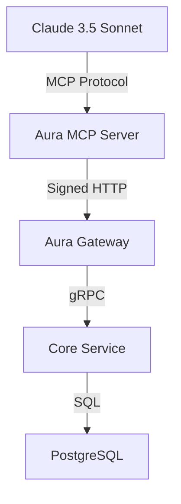

# Aura MCP Server

**Model Context Protocol (MCP) Server for Aura Platform**

This server acts as a proxy between AI models (like Claude 3.5 Sonnet) and the Aura Platform, allowing LLMs to discover and use Aura's capabilities natively via the MCP standard.

## 🎯 Features

- **Proxy Client Architecture**: Connects to Aura Gateway and handles cryptography internally
- **Automatic Key Management**: Generates temporary Ed25519 wallet on startup
- **Two Powerful Tools**:
  - `search_hotels()` - Semantic search across hotel inventory
  - `negotiate_price()` - AI-powered price negotiation
- **Graceful Error Handling**: Clear error messages for LLM consumption
- **Configuration**: Environment variables for easy deployment

## 🏗️ Installation

### Prerequisites

- Python 3.12+
- `uv` package manager (recommended)
- Aura Gateway running on `http://localhost:8000` (default)

### Setup

```bash
# Navigate to MCP server directory
cd adapters/mcp-server

# Install dependencies using uv
uv sync

# Or use pip
pip install -r requirements.txt  # (if you create one)
```

### Environment Configuration

Copy the `.env` file and modify as needed:

```bash
cp .env .env.local
```

Edit `.env.local` to configure:

```env
# Aura Gateway URL
AURA_GATEWAY_URL="http://localhost:8000"

# MCP Server Configuration
MCP_HOST="0.0.0.0"
MCP_PORT=8080

# Logging level
LOG_LEVEL="INFO"
```

## 🚀 Running the Server

### Start the MCP Server

```bash
# Using uv
uv run python server.py

# Or directly with Python
python server.py
```

### Expected Output

```
2024-01-01 12:00:00 - aura-mcp-server - INFO - 🔑 Generated temporary agent wallet
2024-01-01 12:00:00 - aura-mcp-server - INFO -    DID: did:key:abc123...
2024-01-01 12:00:00 - aura-mcp-server - INFO -    Public Key: abc123...
2024-01-01 12:00:00 - aura-mcp-server - INFO - 🚀 Starting MCP server on 0.0.0.0:8080
2024-01-01 12:00:00 - aura-mcp-server - INFO - 🔗 Connecting to Aura Gateway at http://localhost:8000
```

## 🤖 Connecting to Claude Desktop

### Configuration

To connect this MCP server to Claude Desktop:

1. **Open Claude Desktop settings**
2. **Navigate to "Tools" or "Integrations" section**
3. **Add new MCP connection**:
   - **Server URL**: `http://localhost:8080`
   - **Name**: `Aura Platform`
   - **Description**: `AI-powered hotel search and negotiation`

### Configuration File Location

Claude Desktop typically stores configuration in:

- **macOS**: `~/Library/Application Support/Claude/Tools/config.json`
- **Windows**: `%APPDATA%\Claude\Tools\config.json`
- **Linux**: `~/.config/Claude/Tools/config.json`

### Manual Configuration

Add this to your Claude Desktop tools configuration:

```json
{
  "tools": [
    {
      "name": "Aura Platform",
      "type": "mcp",
      "url": "http://localhost:8080",
      "description": "AI-powered hotel search and negotiation system",
      "enabled": true
    }
  ]
}
```

## 🛠️ Tools Reference

### `search_hotels(query: str, limit: int = 3) -> str`

**Description**: Search for hotels matching a query using semantic search.

**Parameters**:
- `query` (string, required): Search query (e.g., "Luxury stay with spa and ocean view")
- `limit` (integer, optional): Maximum results (default: 3, max: 50)

**Returns**: Formatted string with hotel names, prices, and relevance scores

**Example Usage**:
```
search_hotels("Luxury beach resort with spa", limit=3)
```

**Example Response**:
```
🏨 Search Results:
Luxury Beach Resort - $1000.00 (Relevance: 0.95) - 5-star resort with private beach and spa facilities
Ocean View Suite - $800.00 (Relevance: 0.87) - Luxury suite with panoramic ocean views
Seaside Villa - $1200.00 (Relevance: 0.82) - Private villa with direct beach access
```

### `negotiate_price(item_id: str, bid: float) -> str`

**Description**: Negotiate price for a specific hotel/item.

**Parameters**:
- `item_id` (string, required): ID of the item to negotiate (from search results)
- `bid` (number, required): Bid amount in USD (minimum: $0.01)

**Returns**: Negotiation result with appropriate status

**Possible Responses**:
- `🎉 SUCCESS! Reservation: MISTRAL-1234567890` - Bid accepted
- `🔄 COUNTER-OFFER: $950.00. Message: We cannot accept less than $950 for this premium item.` - Counteroffer
- `🚨 HUMAN INTERVENTION REQUIRED. Template: high_value_confirm` - Manual approval needed
- `🚫 REJECTED` - Bid rejected
- `❌ Negotiation failed: ...` - Error occurred

**Example Usage**:
```
negotiate_price("hotel_alpha", 850.0)
```

## 🔧 Development

### Testing the Server

You can test the server using the provided simulators:

```bash
# Test search functionality
python -c "
import asyncio
from server import AuraMCPServer

async def test():
    server = AuraMCPServer()
    result = await server.search_hotels('Luxury beach resort', limit=2)
    print(result)
    await server.shutdown()

asyncio.run(test())
"

# Test negotiation functionality
python -c "
import asyncio
from server import AuraMCPServer

async def test():
    server = AuraMCPServer()
    result = await server.negotiate_price('hotel_alpha', 850.0)
    print(result)
    await server.shutdown()

asyncio.run(test())
"
```

### Debugging

Set `LOG_LEVEL=DEBUG` in your `.env` file for detailed logging:

```bash
export LOG_LEVEL=DEBUG
python server.py
```

## 📊 Architecture



### Data Flow

1. **LLM Request**: Claude sends MCP request to local server
2. **Request Signing**: MCP server signs request with temporary Ed25519 wallet
3. **Gateway Call**: Signed request sent to Aura Gateway
4. **Core Processing**: Gateway routes to Core Service for business logic
5. **Response Formatting**: MCP server formats response for LLM consumption
6. **LLM Response**: Formatted result returned to Claude

## 🔒 Security

- **Temporary Wallet**: New Ed25519 keys generated on each startup
- **Request Signing**: All requests to Aura Gateway are cryptographically signed
- **No LLM Key Management**: Cryptography handled internally by MCP server
- **Error Sanitization**: Sensitive error details removed from LLM responses

## 📖 Troubleshooting

### Common Issues

**MCP package not found**:
```bash
pip install mcp
```

**Connection to Aura Gateway failed**:
- Ensure Aura Gateway is running: `cd api-gateway && uv run python -m src.main`
- Check URL in `.env`: `AURA_GATEWAY_URL="http://localhost:8000"`
- Verify network connectivity

**Port already in use**:
```bash
# Find and kill process on port 8080
lsof -i :8080
kill -9 <PID>
```

### Logs

Check server logs for detailed error information:

```bash
# Run with debug logging
export LOG_LEVEL=DEBUG
python server.py
```

## 🤝 Contributing

1. **Fork the repository**
2. **Create a feature branch**: `git checkout -b feat/mcp-enhancement`
3. **Make your changes**
4. **Test thoroughly**
5. **Submit a pull request**

## 📄 License

This project is licensed under the MIT License. See the main [LICENSE](../LICENSE) file for details.

## 📚 Related Documentation

- [Aura API Specification](../../docs/API_SPECIFICATION.md)
- [Aura Architecture](../../docs/ARCHITECTURE.md)
- [Model Context Protocol](https://docs.anthropic.com/claude/docs/model-context-protocol)

---

**Need help?** Open an issue or contact the Aura development team.