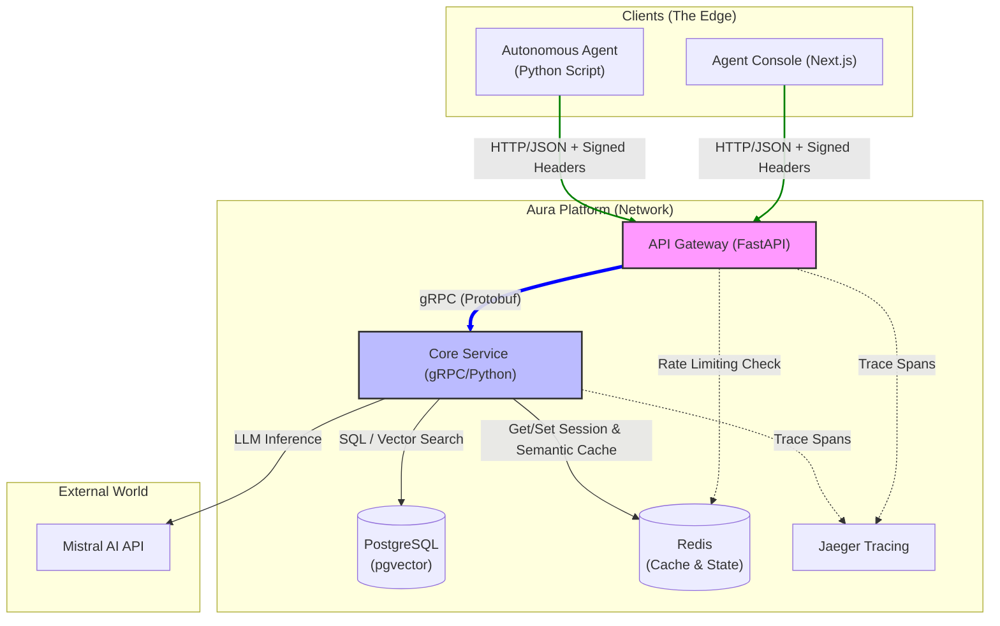
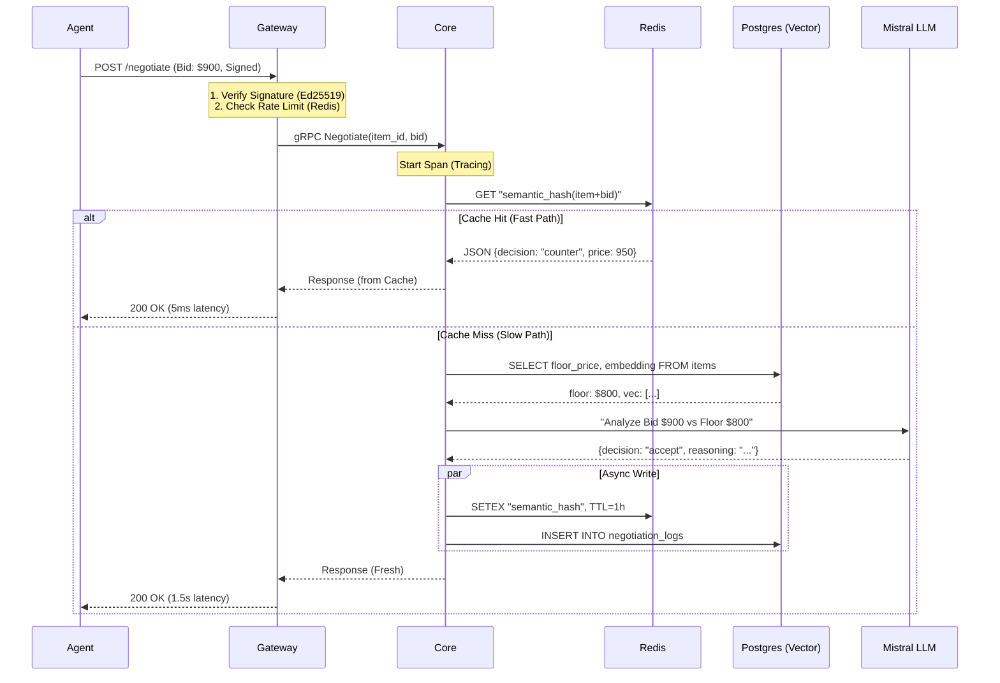

# Aura Platform Architecture

## Overview
Aura is an Agent-Oriented Service Gateway designed to facilitate autonomous economic negotiations between AI agents and service providers.

## Core Components

### System Landscape (C4 Container Diagram)

### 1. API Gateway (The Diplomat)
- **Tech**: Python / FastAPI / Uvicorn
- **Port**: 8000
- **Role**: 
  - Validates Agent Identity (DID/Tokens).
  - Translates HTTP JSON requests to internal gRPC calls.
  - Handles Rate Limiting.

### 2. Core Engine (The Brain)
- **Tech**: Python / gRPC / LangChain / SQLAlchemy
- **Port**: 50051
- **Role**:
  - Manages `Inventory` and `NegotiationSession`.
  - Executes `PricingStrategy` (Rule-based or LLM-based).
  - Enforces `floor_price` logic.

### 3. Storage Layer
- **PostgreSQL**: Stores inventory items and structured negotiation logs.
- **pgvector** (Planned): Will store semantic embeddings for search.

## Data Flow (Negotiation)

1. Agent POSTs to `/v1/negotiate`.
2. Gateway converts to Protobuf `NegotiationRequest`.
3. Core Engine fetches Item from DB (including hidden `floor_price`).
4. Strategy evaluates the Bid:
   - If Bid < Floor -> **Counter-Offer**.
   - If Bid > Trigger Limit -> **JIT UI Required**.
   - Else -> **Accept**.
5. Response is returned to Agent.

## Key Decisions
- **Contract-First**: All APIs defined in `proto/aura/negotiation/v1/`.
- **Stateless Strategies**: Logic does not keep state in memory; all context comes from DB.
- **Hidden Knowledge**: Agents never see `floor_price` directly.