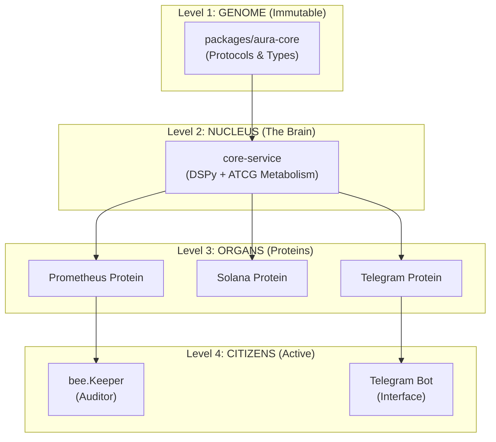

# Aura Hive Architecture Vision

## 🏛️ Overview

Aura Hive is conceived as a cooperative, layered architecture that channels the collective intelligence of many agents (bees) without centralized authority. At a high level, the Hive separates concerns into distinct components – the Runtime, Control, Advisory, and Visual layers – each playing a specialized role in processing, decision-making, monitoring, and presentation.

The Runtime layer is the core “data plane” where Worker Bees execute domain logic and handle tasks. Surrounding it, the Control layer acts as a “control plane” scheduler or orchestrator, deciding what needs to happen. The Advisory layer observes activity and provides guidance or analysis (like Watcher and Advisor Bees), and the Visual layer (with docs/visual/) presents information and blueprints to humans (visualizations, dashboards, “blueprint” diagrams).

These layers mirror common cloud-native patterns: for example, Kubernetes separates a control plane (API server, scheduler, etc.) that “decides what needs to happen” from a data plane of worker nodes that actually do the work[1][2]. In Aura Hive, the Control layer is the “brain” that sets policies and plans, while the Runtime/Worker bees are the “muscles” executing tasks (echoing the control-plane vs data-plane design[2]).

This separation of concerns aligns with hexagonal (ports-and-adapters) architecture: the business logic lives at the core (Runtime), isolated from UIs, databases or infrastructure by defined interfaces[3][4]. The architecture therefore remains loosely coupled and testable – core Hive logic can be changed or tested independently of the outer layers[3][4].

## 🎯 Purpose & Layer Responsibilities

The purpose of the Hive is to enable safe, explainable, and extensible coordination of autonomous processes (the Bees) under human oversight. Each major layer has clear responsibilities:

### Runtime (Worker Bees)

Executes tasks and domain logic. This is where code runs and “work” is done. Worker Bees handle incoming jobs, process data, and emit results. The Runtime is insulated from external changes; it should not directly call up into the Control or Advisory layers, but only respond to interfaces (e.g. APIs, messages) provided by Control.

### Control (Scheduler & Orchestrator)

Manages how and when tasks run. Control Bees make decisions (scheduling, policy, retry rules) but do not perform the tasks themselves. They queue work for Worker Bees and monitor progress. Think of this as the air-traffic control tower: it tells each Worker when and where to fly, but it doesn’t do the flying[1][2].

### Advisory (Advisor & Watcher Bees)

Observes system state and provides guidance. Advisory Bees analyze logs, metrics, and outcomes to suggest improvements or highlight issues. Importantly, they explain and warn but do not enact changes automatically – embodying a “read-only, explain-only” mode. In CNCF terms, this is akin to observability tools: they help infer the system’s state by looking at outputs, but they don’t change system behavior[5][6].

### Visual (Interface / Blueprints)

Renders information for humans. The docs/visual/ directory holds diagrams, blueprints, and other visuals that describe how the Hive is structured and behaves. These visual artifacts are like architectural “mRNA” – instruction sets for how the pieces fit together – but are not executable code. They allow people (Gardeners and analysts) to reason about the system.

### Docs (Documentation)

Contains written guides, protocols, and reference material. The Docs layer underpins all else, codifying designs, policies, and contributor guidance.

---

## 🔗 Layer Communication & Contracts

Each component's interface with the others is carefully controlled. Following layered-architecture principles, each layer only interacts with its adjacent layer[7]. For example, the Control layer may invoke Runtime services (e.g. “run this Worker”), and the Advisory layer may subscribe to Runtime and Control outputs. But we forbid direct dependencies that would invert this flow: for instance, the Runtime never calls back into Control, and Visuals only read state (never trigger actions). This “adjacent-only” rule mirrors standard n-tier design: higher layers build on lower ones, not vice versa[7]. 

By enforcing clear contracts between layers (what inputs and outputs each accepts), we ensure maintainability and testability. In practice, this means adopting interfaces and APIs (ports/adapters) between layers, so that, for example, the Control layer communicates with the Runtime via a defined service API, and the Advisory layer “peeks” at logs or metrics through read-only interfaces. Keeping layers decoupled (as in hexagonal architecture) makes it easy to swap out or upgrade any one layer without rewriting others[3][4].

---

## 🧠 Advisory Philosophy

A core tenet of Aura Hive is human-in-the-loop oversight. Advisors (and the Advisory layer) are explicitly non-authoritative: they provide interpretation, suggestions, and warnings, but never take unilateral action. This follows the CNCF ethos that observability and advisory components should observe rather than control the system. As one cloud-native best practice notes, “observability is a measure of how well an observer can deduce the internal state of a system strictly by observing its outputs” – without altering the system itself[5]. 

In other words, our Advisor Bees and Watcher Bees analyze telemetry and context to explain system behavior to humans; they do not execute commands or override the Control layer. This is analogous to modern AI governance: while generative tools can produce suggestions, “a human-in-the-loop remains essential to ensure quality and alignment”[6]. Aura Hive’s advisors embody that principle by surfacing insights (e.g. “consider refactoring this component,” or “system load is trending high”) and leaving final decisions to people or to the Control Bees under human guidance. This ensures the Hive remains observational, not autocratic: it helps the team understand and improve the system without abdicating human responsibility.

---

## 🐝 System Roles (Bee Roles)

We personify each major function as a Bee role to emphasize autonomy, cooperation, and non-hierarchy. The Hive dispenses with any “queen” or “warrior” type: there is no single point of rule, and no aggression or enforcement beyond planned coordination. Instead, roles include:

### Worker Bee

The workhorses of the Hive. Worker Bees reside in the Runtime layer and handle the core processing tasks (data crunching, job execution, service operations, etc.). They carry out instructions (workflows, jobs) queued by the Control layer. Worker Bees do not watch or advise; they simply execute reliably and report outcomes.

### Watcher Bee

Specialized agents that monitor specific aspects of system health or the environment. For example, a Watcher Bee might keep an eye on a log stream, database status, or external service availability. When a notable event occurs (error, threshold breach, anomaly), a Watcher Bee notifies an Advisor Bee or Control Bee. Watchers do not take action themselves; they only gather and report data (e.g. via metrics or logs) to enable higher-level decision-making.

### Advisor Bee

Knowledgeable analysts that interpret the data collected by Watchers and the system state. Advisor Bees run in the Advisory layer and use heuristics, rules, or even machine learning to suggest improvements. For instance, an Advisor Bee might say “this query is slow – try indexing that column” or “server load is high – consider adding more capacity.” Crucially, Advisor Bees only explain or recommend; they do not implement changes. They are akin to “sages” or “helpers,” not commanders.

### Scribe Bee

Documentation guardians. Scribe Bees are responsible for capturing important artifacts of the Hive: architecture diagrams, data schemas, meeting notes, runbooks, etc. They populate the Docs layer, ensure knowledge is written down, and keep the project’s stories and blueprints up to date. By maintaining the collective memory, Scribes help the Hive learn and onboard new members (human or agent).

### Gardener Bee

Maintainers and support. These bees tend to the overall environment and long-lived tasks: for example, cleaning up stale resources, updating dependencies, or nurturing new feature branches. The Gardener Bee might also manage the docs/visual/ blueprints – planting the seeds for future capabilities. Gardener Bees ensure the Hive’s infrastructure remains healthy and the codebase stays tidy.

---

All of these roles are cooperative, not competitive. There are no "queen bees" issuing top-down orders, and no "warrior bees" attacking errors. Instead, each role contributes where it excels, in line with multi-agent design principles. For example, Agent-oriented systems often function best when agents specialize and share information, much like worker and advisor bees collaborating[3][4]. 

Aura Hive follows that philosophy, with each Bee implementing the **ATCG-M metabolism pattern** (Aggregator, Transformer, Connector, Generator, Membrane) — a fractal architecture where every service follows the same 5-nucleotide structure, ensuring roles interlock gracefully and remain compatible with human-centered design.

---

## 📚 Layer Contracts and Communication

These layers adhere to the layered (n-tier) architecture pattern. Each layer has a distinct set of responsibilities, and layers only communicate with their immediate neighbors[7]. In practice, this means we define contracts (APIs, schemas, protocols) for every layer boundary. For example, the Control → Runtime contract might be a REST or message interface where control-plane code can launch jobs. The Advisory → Control contract might be a monitored log or an events stream. Crucially, higher layers depend on lower ones, not vice versa[7]. The Runtime layer does not call the Control layer; it only implements the contract the Control layer uses. The Visual layer only reads data from the Advisory layer (for display) and never writes back. By following this one-way dependency rule and the adjacent-only communication principle, we prevent cyclic dependencies and keep the design clean and maintainable[7].

This layered approach also meshes with domain-driven hexagonal architecture: the Runtime “domain” is kept pure, with infrastructure (adapters) in the Control/Advisory layers. The AWS Hexagonal pattern notes that isolating domain logic from external systems makes the core easier to test and evolve[4]. In Aura Hive, the core Hive logic (task processing, business rules) sits at the center, while adapters (API servers, databases, UI code) reside in outer layers. This ensures that, for example, we could swap out a data store or visualization tool without touching the core algorithm.

---

## 🎨 Visual Reasoning Integration

Visual reasoning is integral to Aura Hive's design. The docs/visual/ folder contains the “blueprint” diagrams and templates that define how the Hive’s pieces fit together – akin to an mRNA blueprint for features. These visuals encode knowledge (sequencing, dependencies, workflows) in a human-friendly form. For instance, a workflow diagram might specify that “Gardener Bees plant new feature branches, which CI Bees build and test,” and such diagrams can be rendered or versioned as code. However, it’s vital to remember these visuals are descriptive, not executable. They instruct developers and advisors how to assemble the Hive, rather than telling it to perform actions automatically.

To operationalize this, we include a CI Bee in the Control layer. The CI Bee’s job is strictly continuous integration and testing. It builds, tests, lints, and packages code whenever changes occur (e.g. on GitHub PRs), but it does not “magically” deploy to production or make creative decisions. In DevOps terms, the CI Bee implements continuous integration (automated merging and testing of changes) and supports continuous delivery (preparing artifacts for deployment)[8]. Critically, we do not give it the keys to automatically push to production – deployments remain a deliberate step under human or control-plane authority. As Red Hat’s CI/CD guide explains, CI automates integration and testing, while stopping short of automatic production release[8]. In other words, the CI Bee follows a “Continuous Delivery” model: it turns code into releasable artifacts, but the final launch is gated by policy or manual approval. This ensures there is always oversight before any big change goes live.

Meanwhile, the visuals in docs/visual/ inform both humans and advisor agents. For example, an Advisor Bee might consult a stored blueprint to verify that an implemented feature matches its design. The key principle is that visual artifacts guide action without themselves executing anything. They are part of the documentation and reasoning layer, not part of the codebase layer.

---

## 📐 Extension and Standardization

Aura Hive is designed to grow in a disciplined, community-friendly way. We adopt structured conventions for proposals and contributions:

### Feature Requests (FR-xxx)

Any new idea or enhancement proposal gets an FR-<number> issue. These should describe the problem and desired outcome, following best practices (like providing use cases, context, and concise titles). Issues are marked “FR” and discussed openly. If someone else is already working on it, new contributors can add a 👍 reaction or comment to signal interest.

### Protocols (PRO-xxx)

Formal specifications or interface proposals (e.g. message schemas, API protocols, data formats) use PRO-<number>. A Protocol issue lays out the technical blueprint in detail. This might include API definitions, sequence diagrams, or state machines. The community reviews and refines Protocols as a standard contract between layers or components.

### Implementations (IMP-xxx)

Once a Feature or Protocol is approved, actual code/infra work is tracked under IMP-<number>. Implementation issues or PRs reference the corresponding FR or PRO, indicating the work delivers that feature or spec. The IMP prefix clarifies that the issue is about building or configuring something concrete.

---

In general, contributors are encouraged to follow clear GitHub PR/issue guidelines. For example, we use issue and PR templates to enforce descriptions, labels, and linking of related artifacts. The CNCF recommends leveraging such templates and automated checks to make contribution workflows smoother[9]. Bots and CI checks can automatically label FR/PRO/IMP issues or reject PRs missing required tests. We aim for a “smooth PR experience”: new contributors get prompt reviews and guidance, and maintainers enforce quality by specifying expectations (as CNCF projects do[9]). 

In practice, a Pull Request should reference the relevant FR- or PRO- issue, explain the changes clearly, and pass all automated tests before review. This ensures every change is traceable to a design discussion. By standardizing our naming (FR/PRO/IMP) and reviewing process, we keep the Hive’s growth orderly and collaborative – much like well-organized honeycomb cells coming together.

---

## 🌻 Final Note

Bees cooperate. They do not rule. In Aura Hive, every agent’s role is to help and support others, not to dominate them. We believe the best systems emerge from collaboration, mutual care, and transparent communication. Our advisors offer guidance, our workers carry it out, our watchers keep watch, and our scribes record the story – all under the gentle oversight of human stewards. This architectural vision reflects that spirit: a hive of intelligent helpers, each doing its part in concert, without any single bee telling all the others what to do.

---

## 📖 Sources

Aura Hive's principles are informed by cloud-native architecture and agent design patterns[1][2][3][4], as well as CNCF guidance on observability and contributions[5][6][7][8][9]. Each citation connects to best practices or design rationales that shaped this vision.

- [1] [2] Control Plane vs. Data Plane — The Brains and Muscles of Modern Cloud Systems | by Kavishka Fernando | Medium
https://medium.com/@kavishkafernando/control-plane-vs-data-plane-the-brains-and-muscles-of-modern-cloud-systems-292e9f8a0644
- [3] [4] Hexagonal architecture pattern - AWS Prescriptive Guidance
https://docs.aws.amazon.com/prescriptive-guidance/latest/cloud-design-patterns/hexagonal-architecture.html
- [5] Advent of Code in Production, Day 13: Observability
https://jenniferplusplus.com/aoc22-day13/
- [6] Combining GenAI & Agentic AI to build scalable, autonomous systems | CNCF
https://www.cncf.io/blog/2025/08/18/combining-genai-agentic-ai-to-build-scalable-autonomous-systems/
- [7] Enterprise software architecture patterns: The complete guide - vFunction
https://vfunction.com/blog/enterprise-software-architecture-patterns/
- [8] What is CI/CD?
https://www.redhat.com/en/topics/devops/what-is-ci-cd
[9] A successful PR workflow | CNCF Contributors
https://contribute.cncf.io/projects/best-practices/community/contributor-growth/pr-workflow/
