# ATCG-M Fractal Pattern: The Universal Bee Architecture

**Abstraction Level:** Level 2 (Cellular) — Internal nucleotide structure

**Purpose:** Demonstrate how EVERY Bee follows the same 5-nucleotide ATCG-M structure, achieving fractal self-similarity across the entire Hive.

---

## The ATCG-M Invariant

According to `FOUNDATION.md:27`, every "Bee" (Service) MUST follow this fractal structure:

- **A (Aggregator):** Collects senses/data
- **T (Transformer):** Reasons via Ona (LLM/DSPy). Uses `<think>` blocks
- **C (Connector):** Acts via Jules (Proteins/IO)
- **G (Generator):** Pulses events to NATS
- **M (Membrane):** Deterministic safety guards

This pattern repeats at **every scale** — from individual services to the entire Hive organism.

---

## Fractal Self-Similarity: Three Examples

### Example 1: bee-keeper (Autonomous Agent)

**Location:** `agents/bee-keeper/src/hive/`

```mermaid
flowchart TB
    subgraph BeeKeeper["🐝 bee-keeper (ATCG-M Cell)"]
        direction TB
        M1_in["🛡️ M (Membrane)<br/>Input validation"]
        A1["📡 A (Aggregator)<br/>aggregator.py<br/>Senses: git diff,<br/>Prometheus, filesystem"]
        T1["🧠 T (Transformer)<br/>transformer.py<br/>LLM audit via reflect()"]
        M1_out["🛡️ M (Membrane)<br/>Output guards"]
        C1["⚡ C (Connector)<br/>connector.py<br/>GitHub comments,<br/>NATS events, git push"]
        G1["📜 G (Generator)<br/>generator.py<br/>HIVE_STATE.md updates"]

        M1_in --> A1 --> T1 --> M1_out --> C1 --> G1
    end

    style BeeKeeper fill:#e6f3ff,stroke:#0066cc,stroke-width:2px
```

**Role:** Architectural auditor. Watches for FOUNDATION.md violations and chronicles findings.

**Trigger:** GitHub Actions on git push

**Output:**
- GitHub PR/commit comments (architectural violations)
- NATS events (`aura.hive.audit`, `aura.hive.injury`)
- HIVE_STATE.md operational log

---

### Example 2: core-service (Sovereign Brain)

**Location:** `core-service/src/hive/`

```mermaid
flowchart TB
    subgraph CoreService["🧠 core-service (ATCG-M Cell)"]
        direction TB
        M2_in["🛡️ M (Membrane)<br/>membrane.py<br/>Prompt injection defense,<br/>floor_price enforcement"]
        A2["📡 A (Aggregator)<br/>aggregator.py<br/>Senses: gRPC requests,<br/>PostgreSQL, Prometheus"]
        T2["🧠 T (Transformer)<br/>transformer.py<br/>LLM negotiation strategy<br/>via litellm/DSPy"]
        M2_out["🛡️ M (Membrane)<br/>Business rule guards,<br/>FailureIntent handling"]
        C2["⚡ C (Connector)<br/>connector.py<br/>PostgreSQL writes,<br/>gRPC responses"]
        G2["📜 G (Generator)<br/>generator.py<br/>NATS events:<br/>aura.hive.events.*"]

        M2_in --> A2 --> T2 --> M2_out --> C2 --> G2
    end

    style CoreService fill:#fff3cd,stroke:#856404,stroke-width:2px
```

**Role:** The Nucleus. Makes economic negotiation decisions using LLM-powered reasoning.

**Trigger:** gRPC NegotiateRequest from api-gateway

**Output:**
- gRPC NegotiateResponse (accept/counter/reject/ui_required)
- NATS events (negotiation outcomes for audit trail)
- PostgreSQL state updates

---

### Example 3: api-gateway (Hive Gate)

**Location:** `api-gateway/src/` (implicit ATCG-M)

```mermaid
flowchart TB
    subgraph Gateway["🚪 api-gateway (ATCG-M Cell)"]
        direction TB
        M3_in["🛡️ M (Membrane)<br/>Rate limiting,<br/>signature verification,<br/>JWT validation"]
        A3["📡 A (Aggregator)<br/>FastAPI endpoints,<br/>HTTP request parsing"]
        T3["🧠 T (Transformer)<br/>Protocol translation:<br/>JSON → Protobuf"]
        M3_out["🛡️ M (Membrane)<br/>Response sanitization"]
        C3["⚡ C (Connector)<br/>gRPC client to<br/>core-service"]
        G3["📜 G (Generator)<br/>Structured logs,<br/>OpenTelemetry traces"]

        M3_in --> A3 --> T3 --> M3_out --> C3 --> G3
    end

    style Gateway fill:#d4edda,stroke:#28a745,stroke-width:2px
```

**Role:** The Hive Gate. Translates HTTP/JSON to gRPC/Protobuf and enforces perimeter security.

**Trigger:** HTTP requests from external agents

**Output:**
- HTTP/JSON responses (translated from gRPC)
- OpenTelemetry traces for observability
- Structured logs for audit

---

## Key Insight: Fractal Recursion

Notice that **all three services have the same shape**:

1. **M (in)** validates inputs
2. **A** senses the environment
3. **T** applies reasoning
4. **M (out)** enforces output constraints
5. **C** takes action
6. **G** chronicles the decision

This fractal pattern means:
- New contributors can **predict internal structure** by knowing the ATCG-M invariant
- Code reviewers can **verify compliance** by checking for all 5 nucleotides
- The architecture **scales** — adding a new Bee just means implementing ATCG-M again

---

## Implementation References

### bee-keeper ATCG-M
- **A:** `agents/bee-keeper/src/hive/aggregator.py` — `BeeAggregator.sense()` (implements Aggregator protocol)
- **T:** `agents/bee-keeper/src/hive/transformer.py` — `BeeTransformer.reflect()` (implements Transformer protocol)
- **C:** `agents/bee-keeper/src/hive/connector.py` — `BeeConnector.act()` (implements Connector protocol)
- **G:** `agents/bee-keeper/src/hive/generator.py` — `BeeGenerator.pulse()` (implements Generator protocol)
- **M:** Implicit in input validation (prompts, file access). *Note: bee-keeper is an advisory-only service without economic decisions, so deterministic guards are minimal. Future enhancement: extract to explicit `membrane.py` for consistency.*

### core ATCG-M
- **A:** `core/src/hive/aggregator.py` — Data collection layer
- **T:** `core/src/hive/transformer.py` — LLM strategy layer
- **C:** `core/src/hive/connector.py` — Database/gRPC action layer
- **G:** `core-service/src/hive/generator.py` — Event emission layer
- **M:** `core-service/src/hive/membrane.py` — **Explicit dual-gate implementation**

### api-gateway ATCG-M
- **A:** `api-gateway/src/main.py` — FastAPI endpoint handlers
- **T:** Implicit in Protobuf message construction
- **C:** gRPC client stubs (`core_service_stub`)
- **G:** OpenTelemetry instrumentation
- **M:** FastAPI middleware (rate limiting, auth)

---

## Verification Checklist

When reviewing a new Bee, confirm it implements:

- [ ] **A (Aggregator)** — Does it sense the environment?
- [ ] **T (Transformer)** — Does it reason about inputs?
- [ ] **C (Connector)** — Does it take actions via Proteins/Skills?
- [ ] **G (Generator)** — Does it pulse events to NATS or chronicle state?
- [ ] **M (Membrane)** — Does it guard inputs and outputs?

If any nucleotide is missing, the service is **incomplete** and violates FOUNDATION.md.

---

## Relation to Canonical Architecture

This diagram implements the fractal pattern defined in:

- `docs/FOUNDATION.md` lines 26-32 (ATCG-M definition)
- `packages/aura-core/src/aura_core/dna.py` lines 147-202 (Protocol definitions)
- Implemented in: `agents/bee-keeper/`, `core-service/src/hive/`, `api-gateway/src/`

---

**End of ATCG-M Fractal Pattern Documentation**

*For the glory of the Hive. 🐝*
