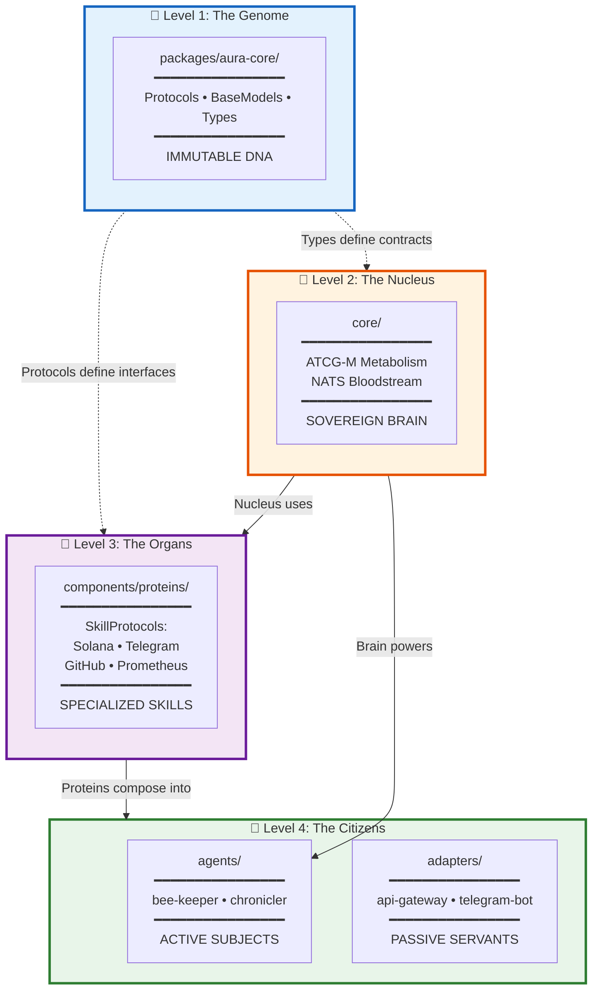
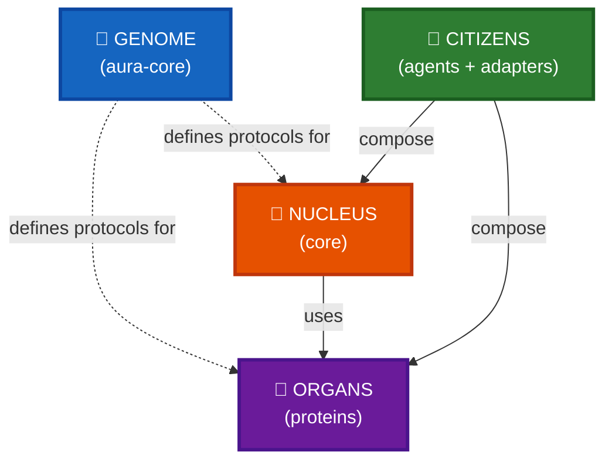
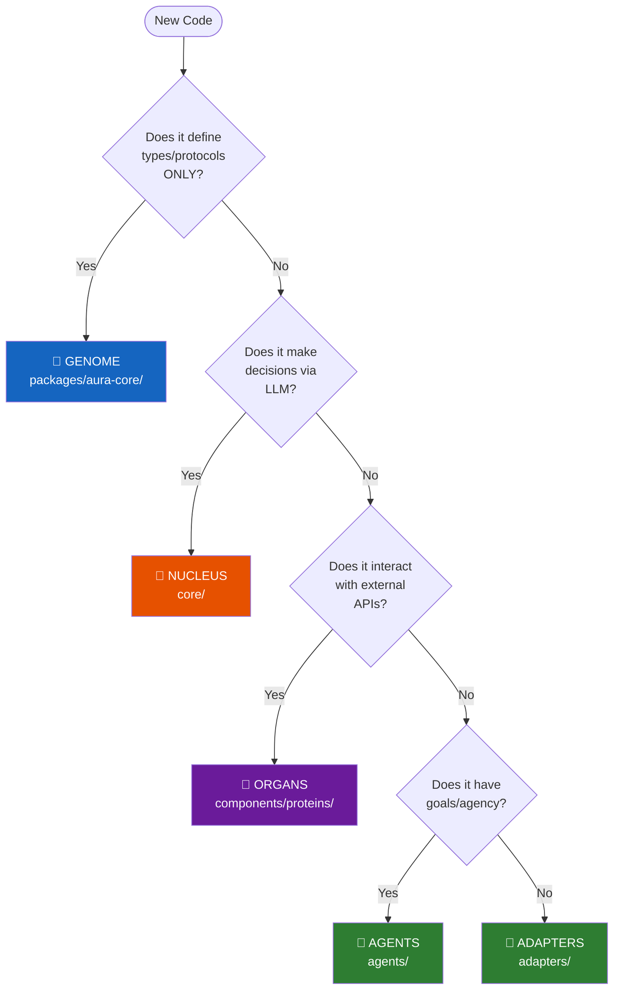

# The Four Ontological Levels: Hive Architecture Layers

**Abstraction Level:** Level 1 (Organism) — Full system architecture

**Purpose:** Map the four ontological levels defined in `FOUNDATION.md` to actual repository directories, showing the separation between immutable DNA, sovereign brains, specialized skills, and composed citizens.

---

## The Ontological Hierarchy

From `FOUNDATION.md:3-24`, every element of the Hive exists at one of four levels:



---

## Level-by-Level Breakdown

### 🧬 Level 1: The Genome (`/packages/aura-core`)

**Status:** Immutable DNA

**Content:**
- Pure Python `Protocols` (SkillProtocol, Aggregator, Transformer, etc.)
- `BaseModels` (Pydantic models for data structures)
- `Type` definitions (TypeAliases, Enums)

**Rule:** **NO business logic. NO external I/O.** This is the shared language of all Bees.

**Example Files:**
```
packages/aura-core/
├── src/
│   └── aura_core/
│       ├── dna.py           # ATCG-M Protocol definitions
│       ├── __init__.py      # Public API exports
│       └── py.typed         # Type hint marker
└── pyproject.toml
```

**Why Immutable?**
Changing the Genome requires coordinated evolution across all Bees. Protocols define the **shared language** — breaking them breaks the entire Hive.

**Verification:**
```bash
# Genome must have ZERO external dependencies (except Pydantic)
grep -r "import requests" packages/aura-core/  # Should return nothing
grep -r "async def.*http" packages/aura-core/ # Should return nothing
```

---

### 🧠 Level 2: The Nucleus (`/core`)

**Status:** The Sovereign Brain

**Content:**
- ATCG-M metabolism implementation (`src/hive/`)
- LLM reasoning strategies (`src/llm/`)
- Database models and migrations (`src/db.py`, `migrations/`)
- NATS Bloodstream communication

**Rule:** Uses the Genome to reason. Communicates via NATS "Bloodstream".

**Directory Structure:**
```
core/
├── src/
│   ├── hive/                   # Sacred ATCG-M implementation
│   │   ├── aggregator.py       # A nucleotide
│   │   ├── transformer.py      # T nucleotide
│   │   ├── connector.py        # C nucleotide
│   │   ├── generator.py        # G nucleotide
│   │   ├── membrane.py         # M nucleotide
│   │   └── metabolism.py       # Orchestrator
│   ├── llm/                    # ReasoningNucleus (Sacred Chamber)
│   │   ├── engine.py
│   │   └── strategy.py
│   ├── guard/                  # HiveMembrane (Sacred Chamber)
│   ├── main.py                 # gRPC service entrypoint
│   └── db.py                   # River (Postgres/Redis memory)
├── migrations/                 # HiveEvolutionaryScrolls
└── tests/                      # ValidationPollen
```

**Why Sovereign?**
The Nucleus makes **decisions**. It has agency. It reasons via LLMs, enforces business rules via Membrane guards, and coordinates the Hive's metabolism.

**Verification:**
```bash
# Nucleus MUST import from Genome, not the other way around
grep -r "from packages.aura_core" core/src/  # Should succeed
grep -r "from core_service" packages/aura-core/      # Should return nothing
```

---

### 🔬 Level 3: The Organs (`/components/proteins`)

**Status:** Specialized Skills

**Content:**
- SkillProtocol implementations for external worlds:
  - `solana/` — Blockchain interactions
  - `telegram/` — Messaging bot skills
  - `github/` — Version control operations
  - `prometheus/` — Metrics collection

**Rule:** Implements specific `SkillProtocols`. **Decoupled from the Brain.**

**Directory Structure:**
```
components/proteins/
├── solana/
│   ├── wallet.py          # Implements WalletSkill protocol
│   └── transaction.py     # Implements TransactionSkill protocol
├── telegram/
│   └── bot.py             # Implements MessagingSkill protocol
├── github/
│   └── api.py             # Implements VersionControlSkill protocol
└── prometheus/
    └── metrics.py         # Implements MetricsSkill protocol
```

**Why Organs?**
Like biological organs (liver, kidneys), each Protein has a **specialized function**. The Brain (Nucleus) doesn't know *how* to interact with Solana — it delegates to the Solana Protein via the SkillProtocol interface.

**Analogy:**
```
Brain → "I need to send a transaction"
Solana Protein → "I know how to do that" (implements TransactionSkill)
Brain → Calls .execute() on the Protein
```

**Verification:**
```bash
# Proteins MUST implement SkillProtocol from Genome
grep -r "class.*Skill.*Protocol" components/proteins/  # Should find implementations
grep -r "from aura_core.dna import.*Skill" components/proteins/  # Should succeed
```

---

### 👥 Level 4: The Citizens (`/agents` & `/adapters`)

**Status:** Active Subjects & Passive Servants

**Content:**
- **Agents** (`/agents/`): Composed entities (Brain + Proteins) with **goals**
  - `bee-keeper/` — Architectural auditor
  - `chronicler/` — Documentation maintainer
- **Adapters** (`/adapters/`): Translation layers with **no goals**
  - `api-gateway/` — HTTP ↔ gRPC protocol translator
  - `telegram-bot/` — Telegram ↔ NATS event bridge

**Rule:**
- **Agents have agency** — They pursue objectives (audit code, maintain docs)
- **Adapters are passive** — They only translate signals between protocols

**Key Difference:**

| Citizen Type | Has Goals? | Examples | Behavior |
|--------------|-----------|----------|----------|
| **Agent** | ✅ Yes | bee-keeper, chronicler | Proactively watches for violations, initiates audits |
| **Adapter** | ❌ No | api-gateway, telegram-bot | Reactively translates requests, has no internal objectives |

**Directory Structure (Agents):**
```
agents/bee-keeper/
├── src/
│   ├── hive/              # Complete ATCG-M implementation
│   │   ├── aggregator.py  # Senses git diffs, Prometheus
│   │   ├── transformer.py # LLM audit reasoning
│   │   ├── connector.py   # GitHub comments, NATS
│   │   ├── generator.py   # HIVE_STATE.md updates
│   │   └── membrane.py    # (implicit in validation)
│   └── main.py
└── prompts/
    └── bee_keeper.md      # Agent's behavioral DNA
```

**Directory Structure (Adapters):**
```
adapters/api-gateway/
├── src/
│   ├── main.py            # FastAPI ↔ gRPC translation
│   ├── config.py
│   └── proto/             # Generated gRPC stubs
└── tests/
```

**Verification:**
```bash
# Agents MUST have hive/ directory (ATCG-M structure)
ls agents/*/src/hive/  # Should list aggregator.py, transformer.py, etc.

# Adapters MUST NOT have hive/ directory (no internal reasoning)
ls adapters/*/src/hive/  # Should return "No such file or directory"
```

---

## Ontological Rules Enforced by bee-keeper

The **bee-keeper** agent audits code for ontological violations:

### ❌ Forbidden: Genome importing from Nucleus
```python
# In packages/aura-core/src/aura_core/dna.py
from core_service.db import User  # HERESY! Genome cannot depend on Nucleus
```

**Why forbidden?** Genome is immutable DNA — it cannot know about specific implementations.

---

### ❌ Forbidden: Proteins knowing about Brain internals
```python
# In components/proteins/solana/wallet.py
from core_service.llm.strategy import LiteLLMStrategy  # HERESY! Organ bypasses Brain
```

**Why forbidden?** Proteins are decoupled skills. They implement protocols but don't know who calls them.

---

### ✅ Allowed: Citizens importing from all levels
```python
# In agents/bee-keeper/src/main.py
from aura_core.dna import Aggregator, Transformer  # ✅ Genome protocols
from core_service.hive.metabolism import MetabolismEngine  # ✅ Nucleus logic
from proteins.github import GitHubSkill  # ✅ Organ skills
```

**Why allowed?** Citizens are **composed entities** at the top of the hierarchy. They orchestrate lower levels.

---

## Visual Summary: Information Flow Direction



**Key Insight:** Information flows **downward** (definitions) and **upward** (composition), but never sideways or in cycles.

---

## Decision Tree: "Where Does My Code Belong?"

Use this flowchart to determine the correct ontological level for new code:



---

## Relation to Canonical Architecture

This diagram implements the ontological hierarchy defined in:

- `docs/FOUNDATION.md` lines 3-24 (Four Levels)
- `packages/aura-core/src/aura_core/dna.py` (Genome implementation)
- `core/src/hive/` (Nucleus implementation)
- `components/proteins/` (Organs implementation)
- `agents/`, `adapters/` (Citizens implementation)

---

**End of Ontological Hierarchy Documentation**

*For the glory of the Hive. 🐝*
