# Aura Hive — Visual Reasoning Index

This section provides a visual overview of Aura Hive
from an **advisory and reasoning perspective**.

The diagrams in this section illustrate how observability signals,
events, and interpretations relate conceptually.

---

## Hive-Level Cellular Map

**Abstraction Level:** Level 2 (Cellular) — Shows ATCG-M nucleotide interactions within a Bee Advisor

```mermaid
flowchart TB
    subgraph Advisor["🐝 Bee Advisor (Complete ATCG-M Cell)"]
        direction TB
        M_in["🛡️ M (Membrane In)<br/>Validate Signals<br/>Guard Against Injection"]
        A["📡 A (Aggregator)<br/>Senses: Git Diffs + Prometheus<br/>+ Filesystem"]
        T["🧠 T (Transformer)<br/>LLM Audit + Reasoning<br/>via Ona (DSPy)"]
        M_out["🛡️ M (Membrane Out)<br/>Enforce Rules<br/>Prevent Data Leakage"]
        C["⚡ C (Connector)<br/>Acts via Jules:<br/>GitHub + NATS + Git"]
        G["📜 G (Generator)<br/>Pulses Chronicles<br/>+ State Updates"]

        M_in --> A --> T --> M_out --> C
        C --> G
    end

    Services[Production Services<br/>api-gateway • core] --> Observability[Observability Signals<br/>Metrics / Logs / Traces]
    Observability --> M_in

    C --> |GitHub Comments| GitHub[GitHub PR/Commit]
    C --> |Events| NATS[NATS Bloodstream<br/>aura.hive.audit<br/>aura.hive.injury]
    G --> |Chronicles| HiveState[HIVE_STATE.md<br/>Operational Memory]

    Operator[👤 Human Operator] -.-> |Reads| GitHub
    Operator -.-> |Reads| HiveState
    Operator -.-> |Triggers via git push| Services

    style Advisor fill:#fff3cd,stroke:#856404,stroke-width:2px
    style M_in fill:#ffcccc,stroke:#cc0000
    style M_out fill:#ffcccc,stroke:#cc0000
    style T fill:#cce5ff,stroke:#0066cc
```

**Signal Metabolism Flow:**
1. **Inbound Membrane (M)** validates observability signals, detects prompt injection
2. **Aggregator (A)** collects git diffs, Prometheus metrics, filesystem state
3. **Transformer (T)** reflects on architectural purity via LLM reasoning
4. **Outbound Membrane (M)** enforces business rules, prevents data leakage
5. **Connector (C)** acts through Jules proteins (GitHub comments, NATS events)
6. **Generator (G)** pulses chronicles to HIVE_STATE.md and event streams

---

## How to Read These Diagrams

* Diagrams describe **interpretation**, not execution
* Solid arrows indicate **signal metabolism** (active processing through ATCG-M)
* Dashed arrows indicate **observation** (humans reading state)
* Subgraphs show **cellular boundaries** (complete ATCG-M organisms)
* No diagram implies automation or authority

These diagrams answer the question:

> *“How does the hive understand itself?”*

---

## Relation to Advisory Model

Visual diagrams are aligned with the declarative advisory model
defined in:

* `imp/imp-001/hive.yaml`
* `docs/standards/STD-001.md`
* `docs/standards/IMP-001.md`
> *"How does the hive understand itself through its fractal ATCG-M metabolism?"*

---

## 🧬 Hive Metaphor Key

Aura Hive uses **Technical Folklore** — bio-organic metaphors layered over precise technical architecture. This table bridges newcomers (who need literal terms) and established contributors (who think in metaphors):

| Bio-Organic Term | Technical Equivalent | Rationale | Code Reference |
|------------------|---------------------|-----------|----------------|
| **Bee** | Autonomous Service | Self-contained, cooperative agents with agency | `agents/bee-keeper/` |
| **ATCG-M** | Service Architecture Pattern | DNA analogy for fractal 5-nucleotide structure | `FOUNDATION.md:27` |
| **A (Aggregator)** | Input/Sensor Layer | Collects signals from environment | `dna.py:153-156` |
| **T (Transformer)** | Reasoning/LLM Layer | Processes signals via Ona (DSPy, LangChain) | `dna.py:160-163` |
| **C (Connector)** | Output/Action Layer | Acts through Jules (Proteins/Skills) | `dna.py:167-170` |
| **G (Generator)** | Event/Chronicle Layer | Pulses state updates and events | `dna.py:174-177` |
| **M (Membrane)** | Input/Output Guards | Immune system: validates inputs, enforces rules | `core/src/hive/membrane.py` |
| **Bloodstream** | NATS Event Bus | Circulatory system distributes signals | `FOUNDATION.md:14` |
| **Proteins** | Skill Adapters (SkillProtocol) | Enzymes enable specific external interactions | `dna.py:184-202` |
| **Sacred Chambers** | Directory Roles | Poetic names for filesystem organization | `dna.py:50-75` |
| **Genome** | `aura-core` package | Immutable DNA (Protocols, BaseModels, Types) | `packages/aura-core/` |
| **Nucleus** | `core` | The sovereign brain | `core/` |
| **Organs** | `components/proteins` | Specialized skills (Solana, Telegram, GitHub) | `components/proteins/` |
| **Citizens** | `agents/` + `adapters/` | Active Subjects (goals) + Passive Servants (translation) | `agents/`, `adapters/` |
| **Ona** | LLM Reasoning Engine | The thinking substrate (DSPy, LangChain) | N/A (conceptual) |
| **Jules** | External Action Engine | The doing substrate (API calls, I/O) | N/A (conceptual) |

**Why Metaphors?**
- **Memorability:** "Membrane guards against injection" is stickier than "input validation layer"
- **Consistency:** Same pattern (ATCG-M) repeats fractally across all services
- **Aesthetic:** Cyber-organic folklore creates a distinct architectural identity

---

## Relation to Canonical Architecture

Visual diagrams are aligned with the canonical architecture defined in:

* `docs/FOUNDATION.md` — Ontological hierarchy and ATCG-M metabolism
* `packages/aura-core/src/aura_core/dna.py` — Protocol definitions
* `HIVE_STATE.md` — Operational status and audit log
* Reference implementations: `agents/bee-keeper/`, `core/src/hive/`

---

## Navigation

### 🧬 Hive-Level Maps (`visual/hive/`)
- **[ATCG-M Fractal Pattern](hive/atcg-fractal.md)** — How EVERY Bee follows the same 5-nucleotide structure
- **[Four Ontological Levels](hive/four-levels.md)** — Genome, Nucleus, Organs, Citizens hierarchy
- **[Sacred Chambers Map](hive/chambers-map.md)** — Poetic directory roles with bio-organic names

### 🔬 Component-Level Views (`visual/components/`)
- **[Membrane Guard Patterns](components/membrane-guards.md)** — Security architecture: inbound/outbound validation

### 🩸 Pipeline & Event Flows (`visual/pipelines/`)
- **[NATS Bloodstream Events](pipelines/nats-events.md)** — Inter-bee choreography via pub/sub events

---

## Status

Visual artifacts are **informative**, **optional**, and **non-normative**.
