# NATS Bloodstream Events: Inter-Bee Choreography

**Abstraction Level:** Level 4 (Ecosystem) — Multi-bee event flows

**Purpose:** Document the NATS event topics, payload structures, and inter-bee communication patterns that form the Hive's "Bloodstream" — the circulatory system distributing signals across autonomous services.

---

## What is the NATS Bloodstream?

From `FOUNDATION.md:14`, the Nucleus (core) **"Communicates via NATS 'Bloodstream'"**.

**NATS** (Neural Autonomic Transport System, via https://nats.io) is the **pub/sub message bus** that enables:
- **Asynchronous choreography** — Bees coordinate without direct coupling
- **Event sourcing** — Chronicles of decisions for audit trails
- **Self-healing signals** — Injury reports trigger automated remediation
- **Distributed observability** — Heartbeats, metrics, and state broadcasts

Unlike synchronous gRPC calls (request/response), NATS events are **fire-and-forget broadcasts** that allow multiple subscribers to react independently.

---

## Event Topic Namespace

All Hive events follow the hierarchical naming convention:

```
aura.<domain>.<category>[.<subcategory>]
```

**Domains:**
- `aura.hive.*` — Internal governance, audits, operational state
- `aura.negotiation.*` — Economic negotiation events (deprecated, use aura.hive.events.*)
- `aura.core.*` — Brain-specific events (failures, diagnostics)

**Categories:**
- `audit` — Architectural compliance reports
- `injury` — Self-healing triggers
- `events.*` — Domain events (negotiation outcomes, user actions)
- `heartbeat` — Service liveness signals
- `brain_dead` — Critical LLM failures

---

## Event Flow Architecture

```mermaid
flowchart TB
    subgraph Bees["Autonomous Bees (Services)"]
        direction TB
        BeeKeeper["🐝 bee-keeper<br/>(Agent)"]
        CoreService["🧠 core<br/>(Nucleus)"]
        TelegramBot["📱 telegram-bot<br/>(Adapter)"]
    end

    subgraph Bloodstream["NATS Bloodstream (Pub/Sub)"]
        direction TB
        Audit["aura.hive.audit<br/>━━━━━━━━━━━━━━━━<br/>Architectural violations"]
        Injury["aura.hive.injury<br/>━━━━━━━━━━━━━━━━<br/>Self-healing triggers"]
        Events["aura.hive.events.*<br/>━━━━━━━━━━━━━━━━<br/>Negotiation outcomes"]
        Heartbeat["aura.hive.heartbeat<br/>━━━━━━━━━━━━━━━━<br/>Service liveness"]
        BrainDead["aura.core.brain_dead<br/>━━━━━━━━━━━━━━━━<br/>LLM failures"]
    end

    subgraph Subscribers["Event Consumers"]
        direction TB
        Chronicler["📜 chronicler<br/>(future agent)<br/>Updates docs"]
        Monitor["📊 Prometheus<br/>Metrics collector"]
        Jaeger["🔍 Jaeger<br/>Trace aggregator"]
    end

    BeeKeeper -->|publish| Audit
    BeeKeeper -->|publish| Injury
    CoreService -->|publish| Events
    CoreService -->|publish| Heartbeat
    CoreService -->|publish| BrainDead
    TelegramBot -->|publish| Events

    Audit -.->|subscribe| Chronicler
    Injury -.->|subscribe| Monitor
    Heartbeat -.->|subscribe| Monitor
    BrainDead -.->|subscribe| Jaeger

    style Bloodstream fill:#fff3cd,stroke:#856404,stroke-width:3px
```



**Key Insight:** Publishers (Bees) don't know who subscribes. Subscribers don't know who published. This decoupling enables the Hive to evolve without breaking contracts.

---

## Event Catalog

### 1. `aura.hive.audit` — Architectural Audits

**Publisher:** `agents/bee-keeper/src/hive/connector.py:169`

**Purpose:** Chronicle architectural violations detected by bee-keeper's LLM audit.

**Payload Schema:**
```json
{
  "timestamp": 1735920000.123,
  "violations": [
    {
      "severity": "critical",
      "file": "core/src/unauthorized_dir/hack.py",
      "rule": "FOUNDATION.md ontological hierarchy",
      "message": "File in unauthorized chamber"
    }
  ],
  "repo": "aura-hive",
  "commit_sha": "abc123",
  "audit_status": "VIOLATIONS_FOUND"
}
```

**Subscribers:**
- **chronicler** (future) — Updates HIVE_STATE.md with audit findings
- **Prometheus** (future) — Metrics for violation trends

**Example Usage:**
```python
# agents/bee-keeper/src/hive/connector.py:169
await nc.publish("aura.hive.audit", json.dumps(payload).encode())
```

---

### 2. `aura.hive.injury` — Self-Healing Triggers

**Publisher:** `agents/bee-keeper/src/hive/connector.py:178`

**Purpose:** Signal critical issues requiring automated remediation (e.g., unauthorized directories, broken tests).

**Payload Schema:**
```json
{
  "timestamp": 1735920000.456,
  "injury_type": "unauthorized_directory",
  "affected_path": "core/src/random_stuff/",
  "severity": "high",
  "recommended_action": "delete_directory",
  "auto_heal": false
}
```

**Subscribers:**
- **auto-healer** (future agent) — Automatically fixes known issues (delete dir, format code)
- **PagerDuty** (future) — Alerts human operators for `auto_heal: false` injuries

**Example Usage:**
```python
# agents/bee-keeper/src/hive/connector.py:177-178
injury_payload = {...}
await nc.publish("aura.hive.injury", json.dumps(injury_payload).encode())
```

---

### 3. `aura.hive.events.*` — Domain Events

**Publisher:** `core/src/hive/generator.py:42`

**Purpose:** Broadcast negotiation outcomes for audit trails, analytics, and downstream reactions.

**Topic Pattern:** `aura.hive.events.{event_type}`

**Examples:**
- `aura.hive.events.negotiation_accepted`
- `aura.hive.events.negotiation_countered`
- `aura.hive.events.negotiation_rejected`
- `aura.hive.events.user_registered`

**Payload Schema:**
```json
{
  "success": true,
  "event_type": "negotiation_accepted",
  "timestamp": 1735920000.789,
  "session_token": "sess_abc123",
  "metadata": {
    "bid_amount": 75.0,
    "final_price": 75.0,
    "item_id": "widget_123"
  }
}
```

**Subscribers:**
- **Analytics service** (future) — Builds negotiation success metrics
- **Billing service** (future) — Triggers payment workflows
- **Audit log** — Compliance records

**Example Usage:**
```python
# core/src/hive/generator.py:40-46
Event(
    topic=f"aura.hive.events.{observation.event_type}",
    payload={"success": True, "event_type": "negotiation_accepted", ...},
    timestamp=now,
)
```

---

### 4. `aura.hive.heartbeat` — Service Liveness

**Publisher:** `core/src/hive/generator.py:51`

**Purpose:** Periodic liveness signals from each Bee to prove it's operational.

**Payload Schema:**
```json
{
  "status": "active",
  "timestamp": 1735920001.012,
  "service": "core",
  "metadata": {
    "cpu_percent": 23.5,
    "memory_mb": 512,
    "active_connections": 42
  }
}
```

**Subscribers:**
- **Prometheus** — Scrapes heartbeats for uptime metrics
- **Health monitor** (future) — Alerts on missing heartbeats (service down)

**Heartbeat Interval:** Default 60 seconds (configurable via `HEARTBEAT_INTERVAL_SEC`)

**Example Usage:**
```python
# core/src/hive/generator.py:49-58
Event(
    topic="aura.hive.heartbeat",
    payload={"status": "active", "timestamp": now, "service": "core"},
    timestamp=now,
)
```

---

### 5. `aura.core.brain_dead` — Critical LLM Failures

**Publisher:** `core/src/hive/transformer.py:71`

**Purpose:** Signal catastrophic LLM failures (API down, timeout, hallucination detection) that require human intervention.

**Payload Schema:**
```json
{
  "timestamp": 1735920002.345,
  "error": "litellm.APIError: OpenAI timeout after 30s",
  "context": {
    "request_id": "req_xyz789",
    "item_id": "widget_456",
    "bid_amount": 50.0
  },
  "fallback_action": "counter_offer",
  "fallback_price": 55.0
}
```

**Subscribers:**
- **PagerDuty** — Immediate alert to on-call engineer
- **Auto-scaler** (future) — Spin up backup LLM providers
- **HIVE_STATE.md updater** — Chronicle brain failures

**Example Usage:**
```python
# core/src/hive/transformer.py:64-71
event = {
    "timestamp": time.time(),
    "error": str(e),
    "context": {...},
}
await nc.publish("aura.core.brain_dead", json.dumps(event).encode())
```

---

## Event Sequence: Complete Negotiation Flow


**Flow:**
1. External agent negotiates via HTTP → gRPC
2. **core** processes, emits `negotiation_accepted` event
3. **core** emits heartbeat every 60s
4. **Prometheus** collects heartbeat for uptime tracking
5. **bee-keeper** (separate flow) audits code, emits `audit` + `injury` events
6. **Prometheus** alerts on injuries

---

## Publisher Implementation Patterns

### Pattern 1: Fire-and-Forget (No Error Handling)

**Use Case:** Non-critical telemetry (heartbeats, low-priority events)

```python
# core/src/hive/generator.py:65-66
await self.nc.publish(event.topic, json.dumps(event.payload).encode())
```

**Behavior:** If NATS is down, event is silently dropped. Service continues.

---

### Pattern 2: Graceful Degradation (Catch Connection Errors)

**Use Case:** Important events that shouldn't crash the service

```python
# core/src/hive/generator.py:64-74
try:
    await self.nc.publish(event.topic, json.dumps(event.payload).encode())
except (nats.errors.ConnectionClosedError, nats.errors.TimeoutError) as e:
    logger.warning("nats_publish_failed", topic=event.topic, error=str(e))
```

**Behavior:** Log warning, continue processing. Event is lost but service survives.

---

### Pattern 3: Retry with Backoff (Critical Events)

**Use Case:** Audit events that MUST be delivered

```python
# agents/bee-keeper/src/hive/connector.py:160-179
try:
    nc = await nats.connect(self.nats_url, connect_timeout=5.0)
    await nc.publish("aura.hive.audit", json.dumps(payload).encode())
except nats.errors.Error as e:
    logger.error("audit_event_failed", error=str(e))
    # Could implement retry queue here
```

**Behavior:** Connection timeout → log error. Could be extended with retry queue.

---

## Subscriber Implementation Patterns

### Pattern 1: Simple Callback

```python
async def message_handler(msg):
    data = json.loads(msg.data.decode())
    logger.info("received_event", topic=msg.subject, data=data)

nc = await nats.connect("nats://localhost:4222")
await nc.subscribe("aura.hive.audit", cb=message_handler)
```

---

### Pattern 2: Queue Groups (Load Balancing)

**Use Case:** Multiple instances of a subscriber should share the workload

```python
# Only ONE instance in the queue group receives each message
await nc.subscribe("aura.hive.events.negotiation_accepted", "analytics-workers", cb=handler)
```

**Behavior:** If 3 instances of `analytics-workers` subscribe, NATS round-robins events to them.

---

### Pattern 3: Durable Subscriptions (At-Least-Once Delivery)

**Use Case:** Events must not be lost, even if subscriber is temporarily down

```python
js = nc.jetstream()
await js.subscribe(
    "aura.hive.audit",
    durable="audit-chronicler",
    cb=audit_handler
)
```

**Behavior:** NATS JetStream persists events; subscriber replays missed events on reconnect.

---

## NATS Configuration

**Environment Variables:**
```bash
# core/.env
NATS_URL=nats://localhost:4222

# agents/bee-keeper/.env
NATS_URL=nats://nats.hive.svc.cluster.local:4222  # Kubernetes DNS
```

**Docker Compose:**
```yaml
# compose.yml
services:
  nats:
    image: nats:latest
    ports:
      - "4222:4222"  # Client connections
      - "8222:8222"  # Monitoring UI
```

**Kubernetes:**
```yaml
# deploy/aura/templates/nats.yaml
apiVersion: v1
kind: Service
metadata:
  name: nats
spec:
  ports:
    - port: 4222
      name: client
```

---

## Monitoring NATS Events

### CLI Subscription (Debugging)

```bash
# Subscribe to all aura.hive.* events
nats sub "aura.hive.>"

# Subscribe to specific topic
nats sub "aura.hive.audit"

# Dump raw payloads
nats sub "aura.hive.events.*" --raw
```

---

### NATS Monitoring Dashboard

Access NATS web UI at `http://localhost:8222` to view:
- Active connections (publishers/subscribers)
- Message rates (msgs/sec)
- Topic statistics (message counts)

---

### Prometheus Metrics (Future)

**Potential Metrics:**
```
aura_nats_events_published_total{topic="aura.hive.audit"} 42
aura_nats_events_failed_total{topic="aura.hive.heartbeat"} 2
aura_nats_subscriber_lag_seconds{subscriber="chronicler"} 1.5
```

---

## Event Versioning Strategy

**Problem:** Event schemas evolve. How do we avoid breaking subscribers?

**Solution:** Semantic versioning in topic names (future)

```
aura.hive.events.v1.negotiation_accepted  # Current
aura.hive.events.v2.negotiation_accepted  # Breaking change (new payload structure)
```

**Migration Path:**
1. Introduce v2 topic
2. Publishers emit to **both** v1 and v2 during transition period
3. Subscribers migrate at their own pace
4. Deprecate v1 after 6 months

---

## Security Considerations

### 1. Topic Authorization (Future)

**Problem:** Prevent rogue services from publishing to `aura.hive.audit`

**Solution:** NATS ACLs (Access Control Lists)

```
# nats-server.conf
authorization {
  users = [
    {user: "bee-keeper", password: "secret", permissions: {
      publish: ["aura.hive.audit", "aura.hive.injury"]
    }},
    {user: "core", password: "secret2", permissions: {
      publish: ["aura.hive.events.*", "aura.hive.heartbeat"]
    }}
  ]
}
```

---

### 2. Payload Encryption (Future)

**Use Case:** Sensitive data (e.g., user PII) in events

**Solution:** Encrypt payload before publishing

```python
encrypted_payload = encrypt(json.dumps(payload), key=NATS_ENCRYPTION_KEY)
await nc.publish("aura.hive.events.user_registered", encrypted_payload)
```

---

## Relation to Canonical Architecture

This event system implements the "Bloodstream" communication pattern defined in:

- `docs/FOUNDATION.md` line 14 (NATS Bloodstream)
- `packages/aura-core/src/aura_core/dna.py` lines 174-177 (Generator protocol)
- `core/src/hive/generator.py` (G nucleotide implementation)
- `agents/bee-keeper/src/hive/connector.py` (Audit event emission)

**NATS Topics Used:**
- `aura.hive.audit` — bee-keeper audits
- `aura.hive.injury` — bee-keeper self-healing triggers
- `aura.hive.events.*` — core domain events
- `aura.hive.heartbeat` — core liveness
- `aura.core.brain_dead` — core LLM failures

---

**End of NATS Bloodstream Events Documentation**

*For the glory of the Hive. 🐝*
